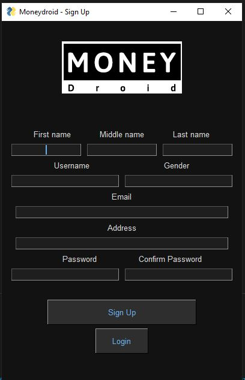
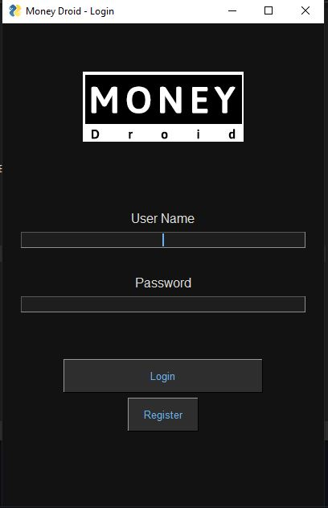
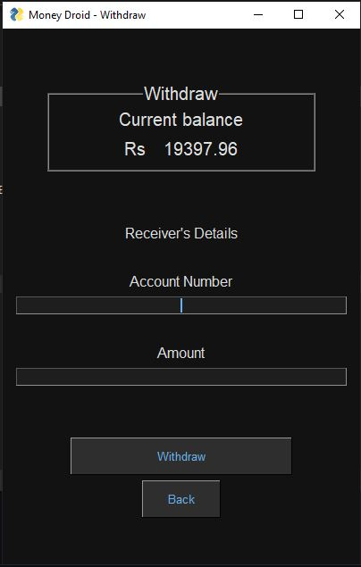
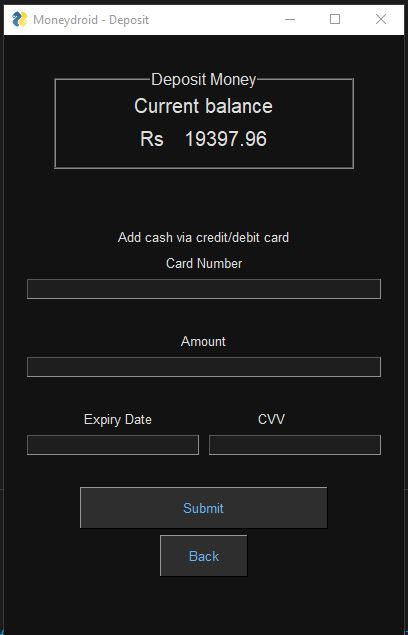
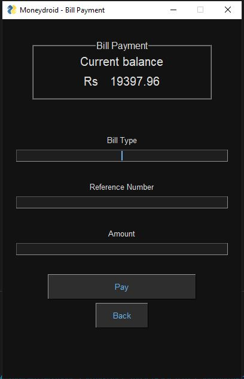

<div id="top"></div>

[![Contributors][contributors-shield]][contributors-url]
[![Forks][forks-shield]][forks-url]
[![Stargazers][stars-shield]][stars-url]
[![Issues][issues-shield]][issues-url]
[![MIT License][license-shield]][license-url]
[![LinkedIn][linkedin-shield]][linkedin-url]

<!-- PROJECT LOGO -->
<br />
<div align="center">
  <a href="https://github.com/othneildrew/Best-README-Template">
    
  </a>

  <h3 align="center">Money Droid - Banking App</h3>

  <p align="center">
    <br />
    <a href="https://github.com/humamchoudhary/Money-Droid-Banking-App"><strong>Explore the docs »</strong></a>
    <br />
    <br />
    <a href="https://github.com/humamchoudhary/Money-Droid-Banking-App">View Demo</a>
    ·
    <a href="https://github.com/humamchoudhary/Money-Droid-Banking-App/issues">Report Bug</a>
    ·
    <a href="https://github.com/humamchoudhary/Money-Droid-Banking-App/issues">Request Feature</a>
  </p>
</div>

<!-- TABLE OF CONTENTS -->
<details>
  <summary>Table of Contents</summary>
  <ol>
    <li>
      <a href="#about-the-project">About The Project</a>
      <ul>
        <li><a href="#built-with">Built With</a></li>
      </ul>
    </li>
    <li>
      <a href="#getting-started">Getting Started</a>
      <ul>
        <li><a href="#prerequisites">Prerequisites</a></li>
        <li><a href="#installation">Installation</a></li>
      </ul>
    </li>
    <li><a href="#usage">Usage</a></li>
    <li><a href="#contributing">Contributing</a></li>
    <li><a href="#contact">Contact</a></li>
    <li><a href="#acknowledgments">Acknowledgments</a></li>
  </ol>
</details>

<!-- ABOUT THE PROJECT -->

## About The Project

A simple Banking app made with python.
The app has the following features:

- SignUp:
  - Only username , token and email is stored in te database
  - Other details are encrpyted using pickle
  - Password is hashed to increase the security
- Login:
  - The input password is compared with the stored hashed password
- Deposit:
  - Depsoit money using a credit card number
  - Card number must have following feature to be valid:
    - Starts with 4,5,6
    - Has 16 digits
- Withdraw:
  - To withdraw money from the account
  - Account number must have following feature to be valid:
    - Starts with 4,5,6
    - Has 16 digits
- Bill Payment:
  - To pay bill
  - Ref number must have following features to be valid:
    - Must have 14 digits
- Transection:
  - To send moeny from one account to an other
  - Account number is the email id of the other user

<p align="right">(<a href="#top">back to top</a>)</p>

### Built With

- [PySimpleGui](https://www.pysimplegui.org)

<p align="right">(<a href="#top">back to top</a>)</p>

<!-- GETTING STARTED -->

## Getting Started

To setup this project locally on your computer follow the steps below.

### Installation

1. Clone the repo
   ```sh
   git clone https://github.com/humamchoudhary/Money-Droid-Banking-App.git
   ```

<p align="right">(<a href="#top">back to top</a>)</p>

### Prerequisites

- pip
  ```sh
  pip install pygame
  ```

## ScreenShots

<strong>Sign Up</strong>:<br>

<br>
<br/>

<strong>Login</strong>:<br/>

<br/>
<br/>
<strong>Main Menu</strong>: <br/>

<br/>
<br/>
<strong>Withdraw</strong>: <br/>

<br/>
<br/>
<strong>Depost</strong>: <br/>

<br/>
<br/>
<strong>Bill Payment</strong>:<br/>

<br/>
<br/>
<strong>Transfer</strong>:<br/>

<br/>
<br/>

## Contribution

The following are the team members for the project:

- [Rafay Qureshi](https://github.com/RafayQureshi12)
- [Talha Khalid](https://github.com/MuhammadTalha28)
- [Abrar Ali](www.github.com/abrarbasra)
- [Abdullah Ijaz](www.github.com)

<!-- CONTACT -->

## Contact

[Muhammad Humam Choudhary](https://www.linkedin.com/in/mhumamch) - humamchoudhary@gmail.com

Project Link: [github.com/humamchoudhary/Money-Droid-Banking-App](https://github.com/humamchoudhary/Money-Droid-Banking-App)

<p align="right">(<a href="#top">back to top</a>)</p>

<!-- MARKDOWN LINKS & IMAGES -->
<!-- https://www.markdownguide.org/basic-syntax/#reference-style-links -->

[contributors-shield]: https://img.shields.io/github/contributors/humamchoudhary/Money-Droid-Banking-App.svg?style=for-the-badge
[contributors-url]: https://github.com/humamchoudhary/Money-Droid-Banking-App//graphs/contributors
[forks-shield]: https://img.shields.io/github/forks/humamchoudhary/Money-Droid-Banking-App.svg?style=for-the-badge
[forks-url]: https://github.com//humamchoudhary/Money-Droid-Banking-App/network/members
[stars-shield]: https://img.shields.io/github/stars/humamchoudhary/Money-Droid-Banking-App.svg?style=for-the-badge
[stars-url]: https://github.com/humamchoudhary/Money-Droid-Banking-App/stargazers
[issues-shield]: https://img.shields.io/github/issues/humamchoudhary/Money-Droid-Banking-App.svg?style=for-the-badge
[issues-url]: https://github.com/humamchoudhary/Money-Droid-Banking-App/issues
[license-shield]: https://img.shields.io/github/license/humamchoudhary/Money-Droid-Banking-App.svg?style=for-the-badge
[license-url]: https://github.com/humamchoudhary/Money-Droid-Banking-App/blob/master/LICENSE.txt
[linkedin-shield]: https://img.shields.io/badge/-LinkedIn-black.svg?style=for-the-badge&logo=linkedin&colorB=555
[linkedin-url]: https://linkedin.com/in/humam-choudhary-362278228/
